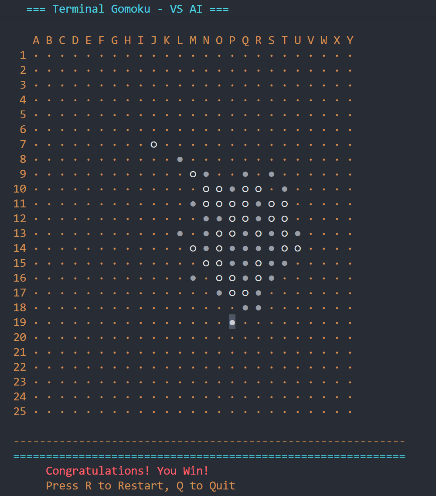

# 终端五子棋 (Gomoku Terminal)

[](https://pypi.org/project/gomoku-terminal/)
[](https://pypi.org/project/gomoku-terminal/)
[](https://opensource.org/licenses/MIT)

一个基于终端的五子棋游戏，支持人机对战，使用键盘控制光标进行游戏。

## 📸 游戏截图



## ✨ 特性

- 🎮 **键盘控制** - 使用方向键移动光标，空格落子
- 🤖 **三种AI难度** - 简单、中等、困难可选
- 🎨 **彩色界面** - 使用curses库实现美观的终端界面
- 🎯 **完整的游戏逻辑** - 五子连珠判定、胜负判断
- 📦 **易于安装** - 通过pip一键安装
- 🌐 **跨平台** - 支持 Windows、Linux、macOS

## 🚀 快速开始

### 安装

```bash
pip install gomoku-terminal
```

> **注意：** Windows 系统会自动安装 `windows-curses` 依赖

### 启动游戏

```bash
# 默认中等难度
gomoku

# 指定难度
gomoku -d easy      # 简单
gomoku -d medium    # 中等
gomoku -d hard      # 困难
```


## 🎮 游戏操作

| 按键 | 功能 |
|------|------|
| **方向键 ↑↓←→** | 移动光标 |
| **空格键** | 在光标位置落子 |
| **Q** | 退出游戏 |
| **R** | 重新开始 |

## 🎯 游戏规则

在 **25×25** 的棋盘上，玩家（黑棋 ●）与 AI（白棋 ○）轮流落子，率先形成横、竖、斜任意方向的连续五子者获胜。

### 符号说明

游戏会自动检测终端是否支持 Unicode 字符：
- **支持 Unicode**：`●`（黑棋）、`○`（白棋）、`◆`（光标）、`·`（空位）
- **不支持 Unicode**：`X`（黑棋）、`O`（白棋）、`#`（光标）、`+`（空位）

### 光标提示

- 光标位置以**反色高亮**显示（使用下划线和加粗效果）
- 即使该位置已有棋子，也能清晰看到光标
- 状态栏实时显示当前光标坐标（如 `A1`, `M13` 等）

## 🤖 AI 难度说明

| 难度 | 算法 | 特点 | 适合玩家 |
|------|------|------|---------|
| **Easy** | 基础策略 | 简单攻守，有一定威胁识别 | 新手玩家 |
| **Medium** | 评分系统 | 全局评估，攻守平衡 | 普通玩家 |
| **Hard** | Minimax + Alpha-Beta | 深度搜索，步步为营 | 高级玩家 |

## 🛠️ 开发


### 从源码运行

```bash
git clone https://github.com/SpongeBaby-124/Gomoku-Terminal-Game.git
cd Gomoku-Terminal-Game
pip install -e .
python -m gomoku
```

### 运行测试

```bash
pytest tests/
```

## 📦 技术栈

- **语言**：Python 3.8+
- **UI库**：curses / windows-curses
- **AI算法**：Minimax + Alpha-Beta 剪枝
- **打包**：setuptools, build, twine

## 🤝 贡献

欢迎贡献！请随时提交 Pull Request。

1. Fork 本仓库
2. 创建你的特性分支 (`git checkout -b feature/AmazingFeature`)
3. 提交你的改动 (`git commit -m 'Add some AmazingFeature'`)
4. 推送到分支 (`git push origin feature/AmazingFeature`)
5. 打开一个 Pull Request

## 📄 许可证

本项目采用 MIT 许可证 - 详见 [LICENSE](LICENSE) 文件

## 🔗 链接

- **PyPI**: https://pypi.org/project/gomoku-terminal/
- **GitHub**: https://github.com/SpongeBaby-124/Gomoku-Terminal-Game

## ⭐ Star History

如果你觉得这个项目不错，请给它一个 Star！

---

Made with ❤️ by Python & Curses
