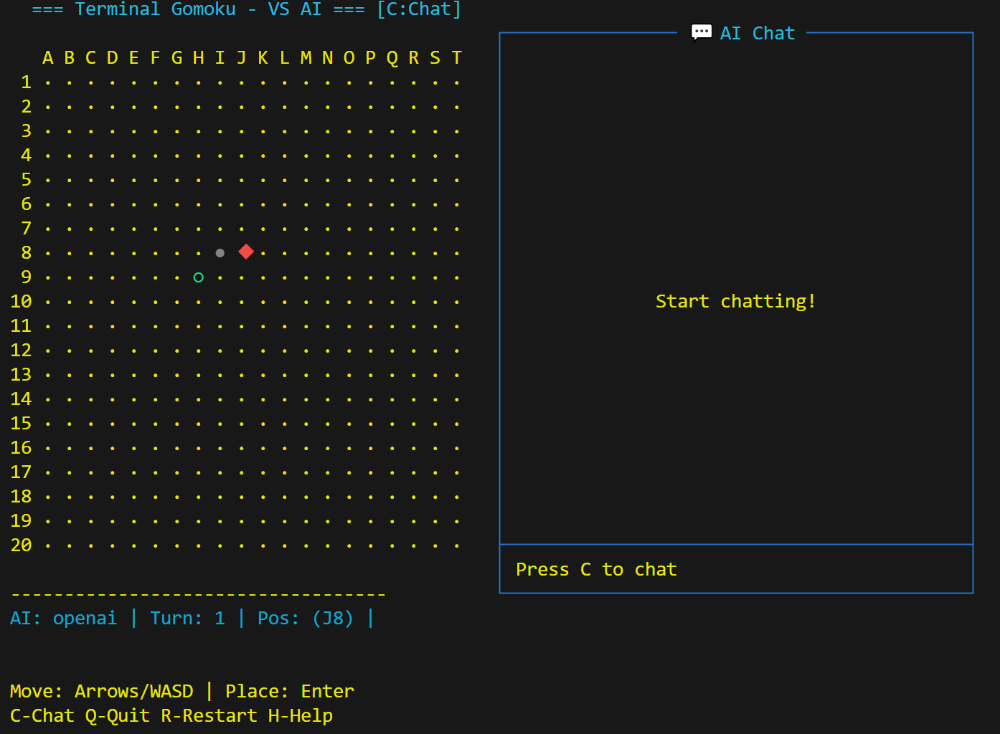

# 终端五子棋 (Gomoku Terminal)

[](https://pypi.org/project/gomoku-terminal/)
[](https://pypi.org/project/gomoku-terminal/)
[](https://opensource.org/licenses/MIT)

一个基于终端的五子棋游戏，支持人机对战，使用键盘控制光标进行游戏。**现已支持与 AI（GPT/Claude/DeepSeek等）实时对战和聊天！**

## 📸 游戏截图



## ✨ 特性

- 🎮 **键盘控制** - 使用方向键移动光标，空格落子
- 🤖 **三种传统AI难度** - 简单、中等、困难可选
- 🧠 **智能AI对战** - 支持 OpenAI GPT、Anthropic Claude、DeepSeek 等进行真正的智能对战
- 💬 **实时聊天** - 在下棋的同时与AI讨论棋局策略
- 🎨 **彩色界面** - 使用curses库实现美观的终端界面
- 🎯 **完整的游戏逻辑** - 五子连珠判定、胜负判断
- 📦 **易于安装** - 通过pip一键安装
- 🌐 **跨平台** - 支持 Windows、Linux、macOS

## 🚀 快速开始

### 安装

```bash
pip install gomoku-terminal
```

> **注意：** Windows 系统会自动安装 `windows-curses` 依赖

### 🎮 四种启动方式

```bash
# 方式一：传统AI简单难度
gomoku -d easy

# 方式二：传统AI中等难度（默认）
gomoku -d medium

# 方式三：传统AI困难难度
gomoku -d hard

# 方式四：智能AI对战（需要先配置API）
gomoku -d ai
```

## ⚙️ AI 服务配置

### 交互式配置（推荐）

```bash
# 进入配置向导
gomoku --config

# 查看当前配置
gomoku --show-config

# 重置配置
gomoku --reset-config
```

配置文件保存在 `~/.gomoku/config.json`，不会污染系统环境变量。

### 支持的 AI 服务

| 服务商 | 说明 | 配置方式 |
|--------|------|----------|
| **OpenAI** | GPT-4o, GPT-4, GPT-3.5 等 | Provider: `openai` |
| **Anthropic** | Claude-3.5, Claude-3 等 | Provider: `anthropic` |
| **DeepSeek** | DeepSeek-Chat 等 | Provider: `openai`（兼容格式）|
| **其他兼容服务** | 任何 OpenAI 兼容 API | Provider: `openai` + 自定义端点 |

### 配置 DeepSeek（OpenAI 兼容格式示例）

由于 DeepSeek 使用 OpenAI 兼容的 API 格式，配置时选择 `openai` 作为提供商：

```bash
gomoku --config
```

按提示输入：
- **Provider**: `openai`
- **API Key**: 你的 DeepSeek API Key
- **Model**: `deepseek-chat`
- **Endpoint**: `https://api.deepseek.com/v1`

或直接编辑 `~/.gomoku/config.json`：

```json
{
  "provider": "openai",
  "api_key": "sk-your-deepseek-key",
  "model": "deepseek-chat",
  "endpoint": "https://api.deepseek.com/v1",
  "timeout": 30,
  "max_retries": 3
}
```

### 命令行参数（临时覆盖配置）

```bash
# 临时使用其他 API Key
gomoku -d ai --api-key sk-xxx

# 临时使用其他端点
gomoku -d ai --endpoint https://api.example.com/v1

# 临时使用其他模型
gomoku -d ai --model gpt-4
```

### 环境变量（备选）

也支持通过环境变量配置（优先级低于命令行参数，高于配置文件）：

| 变量名 | 说明 | 示例 |
|--------|------|------|
| `AI_PROVIDER` | AI 提供商 | `openai`, `anthropic` |
| `AI_API_KEY` | API 密钥 | `sk-...` |
| `AI_MODEL` | 模型名称 | `gpt-4o`, `deepseek-chat` |
| `AI_ENDPOINT` | 自定义端点 | `https://api.deepseek.com/v1` |
| `AI_TIMEOUT` | 超时时间（秒） | `30` |

### 获取 API 密钥

- **OpenAI**: https://platform.openai.com/api-keys
- **Anthropic**: https://console.anthropic.com/
- **DeepSeek**: https://platform.deepseek.com/

### 降级策略

如果 AI 服务不可用（网络问题、API 错误等），游戏会自动降级到传统 AI，确保游戏体验不受影响。

## 🛠️ 开发

### 从源码运行

```bash
git clone https://github.com/SpongeBaby-124/Gomoku-Terminal-Game.git
cd Gomoku-Terminal-Game
pip install -e .
pip install openai anthropic  # 安装 AI 依赖
python -m gomoku
```

### 运行测试

```bash
pytest tests/
```

### 项目结构

```
gomoku/
├── __init__.py
├── __main__.py         # 入口点
├── board.py            # 棋盘逻辑
├── game.py             # 游戏主循环
├── ui.py               # 终端界面（含聊天）
├── ai.py               # 传统 AI 算法
├── config.py           # 配置管理
├── ai_provider.py      # AI 服务抽象层
├── ai_service.py       # AI 服务工厂
├── chat_manager.py     # 聊天管理
├── logger.py           # 日志记录
└── providers/          # AI 提供商实现
    ├── openai_provider.py
    └── anthropic_provider.py
```

## 📦 技术栈

- **语言**：Python 3.8+
- **UI库**：curses / windows-curses
- **AI算法**：Minimax + Alpha-Beta 剪枝
- **AI服务**：OpenAI API, Anthropic API
- **打包**：setuptools, build, twine

## 🐛 常见问题

### 聊天区域不显示？
- 确保终端窗度至少 80 列宽
- 尝试调整终端窗口大小

### AI 落子很慢？
- 检查网络连接
- 可以调小 `AI_TIMEOUT` 值
- 考虑使用更快的模型（如 gpt-3.5-turbo）

### API 密钥错误？
- OpenAI 密钥应以 `sk-` 开头
- Anthropic 密钥应以 `sk-ant-` 开头
- 确保密钥有效且有足够额度

### 日志在哪里？
- 日志文件位于 `~/.gomoku/logs/` 目录
- 可用于调试 AI 服务问题

## 🤝 贡献

欢迎贡献！请随时提交 Pull Request。

1. Fork 本仓库
2. 创建你的特性分支 (`git checkout -b feature/AmazingFeature`)
3. 提交你的改动 (`git commit -m 'Add some AmazingFeature'`)
4. 推送到分支 (`git push origin feature/AmazingFeature`)
5. 打开一个 Pull Request

## 📄 许可证

本项目采用 MIT 许可证 - 详见 [LICENSE](LICENSE) 文件

## 🔗 链接

- **PyPI**: https://pypi.org/project/gomoku-terminal/
- **GitHub**: https://github.com/SpongeBaby-124/Gomoku-Terminal-Game

## ⭐ Star History

如果你觉得这个项目不错，请给它一个 Star！

---

Made with ❤️ by Python & Curses
